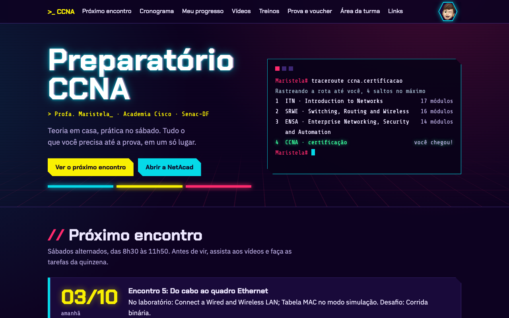
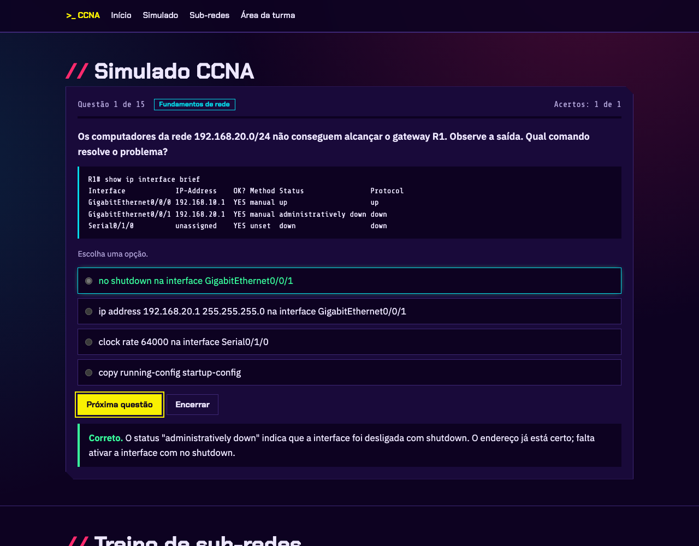

<p align="center">
  
</p>

<p align="center">
  
  
  
  
</p>

<p align="center">
  <b><a href="https://maristelaoliveira.github.io/Preparatorio-CCNAV7/">🌐 Abrir o site</a></b>
  &nbsp;·&nbsp;
  <b><a href="https://maristelaoliveira.github.io/Preparatorio-CCNAV7/treinos.html">🎯 Ir direto para o simulado</a></b>
</p>

---

## `>_ show version`


Prazer, eu sou a **Profa. Maristela**! 👋 Esse memoji piscando sou eu: é a mesma foto da minha conta Microsoft. Então, se ele aparecer no Teams, no e-mail ou em um comentário do Moodle, pode confiar que sou eu mesma, e não um ataque de phishing. 😉

Boas-vindas ao preparatório CCNA da **Academia Cisco da Faculdade de Tecnologia e Inovação Senac-DF**.

Este repositório é o site do curso: o lugar onde ficam o cronograma, os vídeos, os treinos e o caminho até a prova. Nada de slides: aqui a aula é o próprio site.

```text
aluno# traceroute ccna
Rastreando a rota até a certificação, 4 saltos no máximo

 1  ITN   · Introduction to Networks                          17 módulos
 2  SRWE  · Switching, Routing and Wireless Essentials        16 módulos
 3  ENSA  · Enterprise Networking, Security and Automation    14 módulos
 4  CCNA  · certificação                                      você chegou!
```

> Se algum salto mostrar `* * *`, não se preocupe: é só estudar mais um pouco que a rota converge. 😉

---

## 🧭 O que tem no site

| | Seção | Para que serve |
|:-:|---|---|
| 📅 | **Próximo encontro** | Mostra sozinho o próximo sábado, pela data de hoje, e o que fazer antes do encontro. |
| 🗺️ | **Cronograma** | Os 10 encontros do semestre, com laboratório, desafio e tarefas da quinzena. |
| ✅ | **Meu progresso** | Você marca os módulos concluídos na NetAcad. Fica salvo no seu navegador. |
| 🎬 | **Vídeos** | Pílulas de 8 a 12 minutos, filtradas por curso. Saem aos poucos ao longo do semestre. |
| 🎯 | **Simulado CCNA** | Questões no estilo da prova, com feedback na hora ou com cronômetro. |
| 🧮 | **Treino de sub-redes** | Um IP aleatório por vez, até você calcular de olhos fechados. |
| 🎫 | **Prova e voucher** | O passo a passo da NetAcad até o agendamento na Pearson VUE. |
| 🔐 | **Área da turma** | Links do Teams, do Moodle e dos vídeos, com a senha do primeiro encontro. |

<p align="center">
  
</p>

---

## 🤝 Como estudar: o handshake de três vias

A gente usa a **sala de aula invertida**. Funciona igualzinho ao TCP:

| Passo | Mensagem | Quem faz o quê |
|:-:|:-:|---|
| 1 | `SYN` | **Você** faz os módulos da NetAcad em casa (e assiste aos vídeos, quando saírem). |
| 2 | `SYN-ACK` | **A turma** pratica ao vivo no Teams, no sábado: Packet Tracer, desafios e muita pergunta. |
| 3 | `ACK` | **Você** confirma no simulado que o conteúdo chegou inteiro. |

Pular o passo 1 é como mandar um `SYN-ACK` sem ter recebido o `SYN`: a conexão até abre, mas ninguém entende nada. 😅

---

## 🎯 O simulado

<p align="center">
  
</p>

São **133 questões originais** no estilo da prova 200-301, divididas pelos três cursos e pelos seis tópicos oficiais do exame.

- **Modo estudo:** responda e veja na hora se acertou, com a explicação. Sem tempo, sem pressão.
- **Modo prova:** cronômetro, sem voltar e resultado só no final. Igual ao dia da prova, só que sem a tremedeira.
- **Tipos de questão:** uma resposta, "escolha duas", associação e saídas de comando para interpretar (`show ip route`, `show interfaces trunk`, `show ip ospf neighbor`...).
- **Cada tentativa é diferente:** o simulado sorteia as questões, dá prioridade às que você ainda não viu e embaralha as opções. Decorar a posição da resposta não adianta. Entender o conteúdo, sim.
- **No final:** nota, mensagem personalizada, desempenho por tópico e o botão **Salvar imagem do resultado**, para você mandar a sua melhor nota no Teams.

> 🕵️ **"As questões são as da prova?"**
> Não, e isso é bom! Todas foram escritas para o curso. Questões vazadas da prova ("dumps") violam o acordo de confidencialidade da Cisco, podem custar a sua certificação e, de quebra, costumam ter gabarito errado. Aqui você treina o raciocínio, que é o que passa na prova.

---

## ❓ Perguntas frequentes (FAQ, ou `show faq`)

<details>
<summary><b>A professora vê a minha nota do simulado?</b></summary>

Não. O simulado roda inteiro no seu navegador, e nada é enviado para lugar nenhum. Então erre à vontade, refaça quantas vezes quiser e, quando chegar na sua melhor nota, salve a imagem e mande no Teams.

</details>

<details>
<summary><b>Marquei meus módulos e sumiu tudo. E agora?</b></summary>

O progresso fica salvo no navegador que você usou. Em outro navegador, em outro computador ou na janela anônima, ele começa do zero. Não é bug, é privacidade. 😉

</details>

<details>
<summary><b>Esqueci a senha da área da turma.</b></summary>

Ela foi passada no primeiro encontro. Pergunte no grupo da turma ou para a professora. E não, `enable secret` não funciona aqui. 😄

</details>

<details>
<summary><b>Achei um erro em uma questão!</b></summary>

Que ótimo, isso é estudar de verdade! Abra uma <a href="../../issues">issue</a> aqui no GitHub dizendo qual é a questão (por exemplo, `srwe-12`) e o que está errado. Se você tiver razão, entra no gabarito e você ganha o crédito.

</details>

<details>
<summary><b>O site não abre. Socorro!</b></summary>

Antes de tudo, o clássico:

```text
aluno# ping site
.....
Success rate is 0 percent (0/5)
```

Confira a sua conexão, recarregue a página e tente outro navegador. Se continuar sem resposta, avise no Teams. Às vezes o problema está na camada 8 (a gente mesmo). 🙃

</details>

---

## 🛠️ Feito com

<p align="center">
  
</p>

<p align="center">
  
  
  
  
  
  
</p>

Sem framework, sem build e sem `npm install` de 300 MB. Só HTML, CSS e JavaScript puros, que abrem com dois cliques.

---

## 🔬 Por dentro do código

Curioso para saber como funciona? O código está todo comentado em português. Fique à vontade para fuçar.

```text
📁 Preparatorio-CCNAV7
├── index.html          → a página inicial (só a estrutura)
├── treinos.html        → simulado e treino de sub-redes
├── 📁 css
│   └── estilo.css      → o visual cyberpunk inteiro, com índice
├── 📁 js
│   ├── dados.js        → encontros, módulos, vídeos e links
│   ├── questoes.js     → as 133 questões do simulado
│   ├── site.js         → as funções da página inicial
│   └── treinos.js      → o simulado, a imagem do resultado e as sub-redes
└── 📁 assets           → banner, favicon e capturas de tela
```

Algumas coisas legais para estudar no código:

| Conceito | Onde está | O que faz |
|---|---|---|
| **Algoritmo de Fisher-Yates** | `treinos.js` → `embaralhar` | Embaralha as questões e as opções de um jeito justo. |
| **Canvas API** | `treinos.js` → `desenharResultado` | Desenha a imagem do resultado, pixel por pixel. |
| **Web Crypto API** | `site.js` → `abrirCofre` | Abre a área da turma com AES-GCM 256 e PBKDF2, tudo no navegador. |
| **localStorage** | `site.js` → `progresso` | Guarda os módulos marcados entre uma visita e outra. |
| **Cálculo de sub-rede** | `treinos.js` → `subRedes` | Converte IP em número de 32 bits e calcula rede, broadcast e hosts. |

Dica de quem ensina JavaScript: abra o DevTools (`F12`), vá na aba **Sources** e coloque um breakpoint na função `estaCerta`. Depois responda uma questão e veja a correção acontecer passo a passo. 🔍

---

<details>
<summary><b>👩‍🏫 Para a professora: como atualizar o site</b></summary>

- **Datas, encontros, módulos e vídeos:** edite o `js/dados.js`.
- **Questões do simulado:** edite o `js/questoes.js`. Os campos estão explicados no topo do arquivo.
- **Links da turma e dos vídeos (área protegida):** abra o `gerador-area-turma.html` no seu computador, preencha, clique em Gerar e cole o resultado na linha `const AREA_TURMA = "…";` do `js/dados.js`.
- **Novo semestre:** atualize as datas em `ENCONTROS` e gere a área da turma com uma senha nova.
- **Publicação:** GitHub Pages, branch `main`, pasta raiz. O `gerador-area-turma.html` é só para uso local e não vai para o repositório (está no `.gitignore`).

</details>

---

<p align="center">
  <code>&gt; Profa. Maristela_ · Academia Cisco · Faculdade de Tecnologia e Inovação Senac-DF</code>
</p>

<p align="center">
  <sub>Feito com café, Packet Tracer e muito <code>no shutdown</code>. Bons estudos! ☕</sub>
</p>
